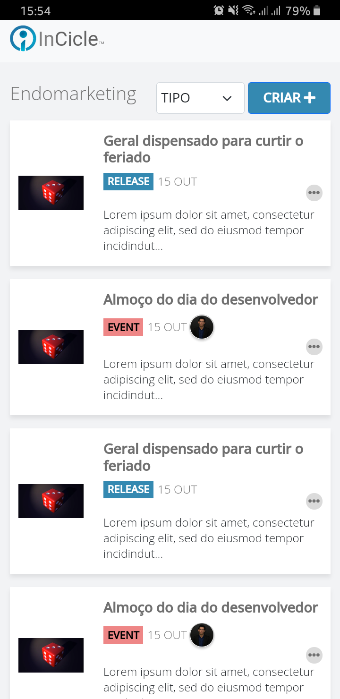
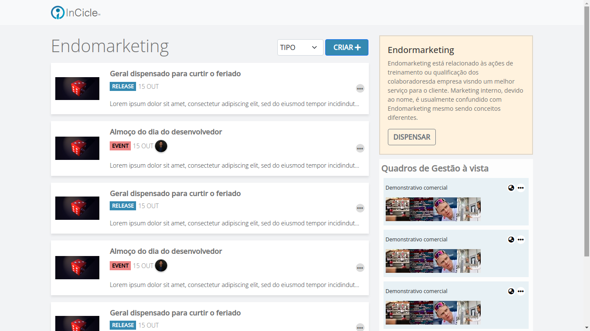

    <h1>:vulcan_salute: Micael Andrade Dos Santos</h1>
    
Teste InCicle (Vaga Júnior Front-End)

    <h3>:email:	<strong>E-mail</strong>: <a href=mailto:mikael.java@gmail.com> mikael.java@gmail.com </a></h3>
    <h3>:grinning:	<strong>Linkedin</strong>: <a href='https://www.linkedin.com/in/micael-andrade-784523220/'>Micael Andrade</a></h3>
    

    
    

## Executando o projeto 😄
- Instale as dependências com `yarn` ou `npm i`
- Rode o projeto com `yarn start` ou `npm start`

## Telas

    
    

## Referências
### Softwares usados
- [Linux Mint Cinnamon 💿](https://linuxmint.com/download.php)
- [Visual Studio Code 💻](https://code.visualstudio.com/)
- [Inkscape 🖼️](https://inkscape.org/pt-br/)
- [Chrome *(Version 96.0.4664.45)* 🌍](https://inkscape.org/pt-br/)
- [Edge *(Version 96.0.1054.43)*  🌍](https://www.microsoft.com/pt-br/edge)
- [Firefox *(Version 94.0)* 🌍](https://www.mozilla.org/pt-BR/firefox/new/)
### Bibliotecas
- [Bootstrap 🅱️](https://getbootstrap.com/)
- [React ☸️](https://pt-br.reactjs.org/)
- [Fontawesome 😎](https://fontawesome.com/g/)
- [Unsplash 🖼️](https://unsplash.com/)
### Linguagens
- JavaScript
- HTML
- CSS
